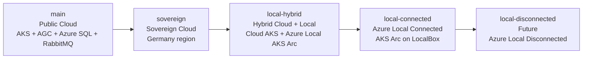
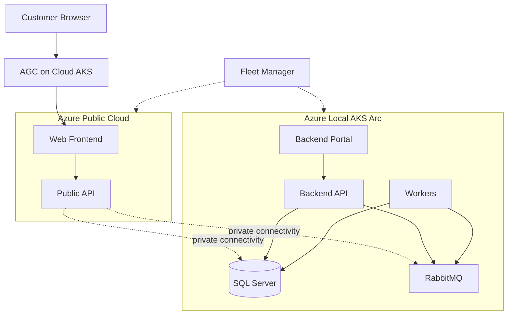
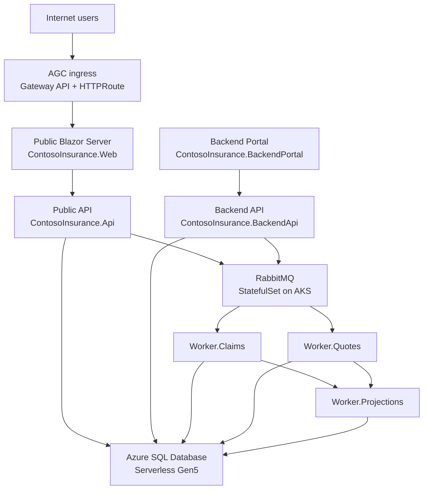

# Contoso Insurance

Contoso Insurance is a **.NET 10 Aspire enterprise application** and **learning lab** for moving a cloud-native system across the Azure deployment continuum: **Azure public cloud -> sovereign cloud -> hybrid cloud + Azure Local -> Azure Local connected -> Azure Local disconnected**.

This `main` branch is the **public cloud baseline**, and the repository documents how the same application evolves across each branch in the continuum.


## Why this repository exists

This solution helps teams learn how to:

- build a modern distributed application with **.NET Aspire**
- run it on **Azure Kubernetes Service (AKS)** and **AKS Arc**
- expose only the right services through **Application Gateway for Containers (AGC)** or private local ingress
- keep the same application architecture while shifting data and workload placement across cloud, sovereign, hybrid, and local environments

## Azure deployment continuum

The branches model a progressive move from fully public cloud to fully local deployment.



## Branch strategy

| Branch | What it represents | Deployment style |
| --- | --- | --- |
| `main` | Azure public cloud baseline | `azd up` |
| `sovereign` | Sovereign cloud deployment in Germany | `azd up` |
| `local-hybrid` | Split deployment across cloud AKS and Azure Local AKS Arc | PowerShell deployment script |
| `local-connected` | Azure Local connected deployment on Jumpstart LocalBox | PowerShell deployment script |
| `local-disconnected` | Future air-gapped Azure Local target | Future/offline workflow |

## Continuum branches

### `main` — Public Cloud

**What it deploys**
- Web frontend and public API on **AKS**
- **AGC** ingress using Gateway API
- **Azure SQL Database** for persistence
- **RabbitMQ** and private backend services in the same cloud-hosted environment

**Architecture overview**
- Single cloud deployment optimized for standard Azure regions
- Customer traffic enters through AGC
- Public and private services stay in Azure, with Azure SQL as the managed data plane
- Best fit for the starting point of the continuum

**How to deploy**
```bash
azd up
```

### `sovereign` — Sovereign Cloud

**What it deploys**
- The same application topology as `main`
- Deployed into a **sovereign Germany region** for residency and compliance needs

**Architecture overview**
- Same logical service split as the public cloud baseline
- Azure-hosted platform services remain in-region to satisfy sovereign placement requirements
- Intended for customers that need cloud benefits with stricter jurisdictional controls

**How to deploy**
```bash
git checkout sovereign
azd env new contoso-sovereign
azd up
```

### `local-hybrid` — Hybrid Cloud + Azure Local

**What it deploys**
- **Cloud side:** web frontend and public API on cloud **AKS** with **AGC** ingress
- **Local side:** backend portal, backend API, workers, **SQL Server**, and **RabbitMQ** on **AKS Arc** in Azure Local
- **Azure Kubernetes Fleet Manager** to manage both clusters as one fleet

**Architecture overview**
- Internet-facing traffic stays in Azure for scale and reach
- Sensitive business processing and data stay on Azure Local for sovereignty and latency reasons
- Fleet Manager governs cloud and local clusters together while placement policies keep workloads on the right side of the boundary



**Cross-cluster communication**
- In the intended hybrid design, the cloud public API reaches local **RabbitMQ** and **SQL Server** through **private connectivity** such as VPN or ExpressRoute.
- In the **Jumpstart LocalBox sandbox**, that path may not exist by default. Without the private network bridge, the cloud cluster cannot directly reach the local data plane, so hybrid deployment is limited to cluster-local validation until networking is configured.
- The backend portal and backend API stay local-only; they are not exposed to the public internet.

**How to deploy**
```powershell
git checkout local-hybrid
./scripts/deploy-hybrid.ps1 `
  -EnvironmentName <env> `
  -CloudClusterName <cloud-aks-name> `
  -CloudResourceGroup <cloud-rg> `
  -LocalClusterName <local-aks-arc-name> `
  -LocalResourceGroup <local-rg> `
  -AcrLoginServer <acr>.azurecr.io `
  -Tag <image-tag>
```

### `local-connected` — Azure Local Connected

**What it deploys**
- Full application stack onto **AKS Arc** running on **Jumpstart LocalBox**
- Azure-connected operations through Arc-enabled services
- Local SQL Server, RabbitMQ, frontend, APIs, backend services, and workers

**Architecture overview**
- Entire workload footprint runs on Azure Local
- Azure remains the control plane for Arc connectivity, governance, registry, monitoring, and identity
- This is the near-edge stage before full disconnection

**How to deploy**
```powershell
git checkout local-connected
./scripts/deploy-local-connected.ps1 `
  -ResourceGroup <local-rg> `
  -ClusterName <local-aks-arc-name> `
  -AcrLoginServer <acr>.azurecr.io `
  -Tag <image-tag>
```

See [docs/local-connected-deployment.md](docs/local-connected-deployment.md) for the end-to-end walkthrough.

### `local-disconnected` — Future Azure Local Disconnected

**What it deploys**
- A future fully local, air-gapped version of Contoso Insurance

**Architecture overview**
- All runtime dependencies stay on-premises
- No required ongoing Azure control-plane connectivity
- Intended as the final continuum stage for the most constrained environments

**How to deploy**
- Not implemented yet; this branch is reserved for the future disconnected workflow.

## Architecture overview for `main`

The `main` branch remains the reference cloud architecture.



## Repository structure

```text
src/
├── ContosoInsurance.AppHost/             # .NET Aspire orchestrator
├── ContosoInsurance.Web/                 # Public Blazor frontend
├── ContosoInsurance.Api/                 # Public API
├── ContosoInsurance.BackendPortal/       # Internal operations portal
├── ContosoInsurance.BackendApi/          # Private workflow API
├── ContosoInsurance.Worker.Claims/       # Claims worker
├── ContosoInsurance.Worker.Quotes/       # Quotes worker
├── ContosoInsurance.Worker.Projections/  # Projection worker
├── ContosoInsurance.Data/                # EF Core data layer
├── ContosoInsurance.Messaging.Contracts/ # Shared contracts
└── ContosoInsurance.ServiceDefaults/     # Shared Aspire defaults

tests/
├── ContosoInsurance.Api.Tests/
├── ContosoInsurance.Data.Tests/
├── ContosoInsurance.Web.Tests/
├── ContosoInsurance.Worker.Tests/
├── ContosoInsurance.AppHost.Tests/
└── ContosoInsurance.E2E/

k8s/
scripts/
infra/
docs/
```

## Running locally

```bash
dotnet run --project src/ContosoInsurance.AppHost
```

## Testing

```bash
dotnet test ContosoInsurance.slnx
```

## References

- [Azure Jumpstart LocalBox](https://jumpstart.azure.com/azure_jumpstart_localbox)
- [Azure Local prerequisites](docs/azure-local-prerequisites.md)
- [Local-connected deployment guide](docs/local-connected-deployment.md)
- [Azure Kubernetes Fleet Manager](https://learn.microsoft.com/azure/kubernetes-fleet/)
- [AKS on Azure Local](https://learn.microsoft.com/azure/aks/hybrid/aks-overview)
