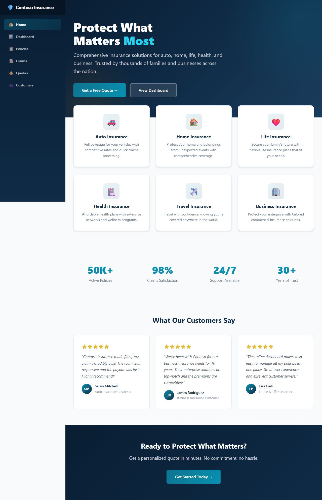
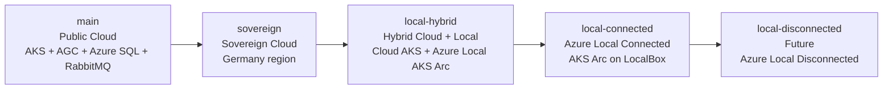
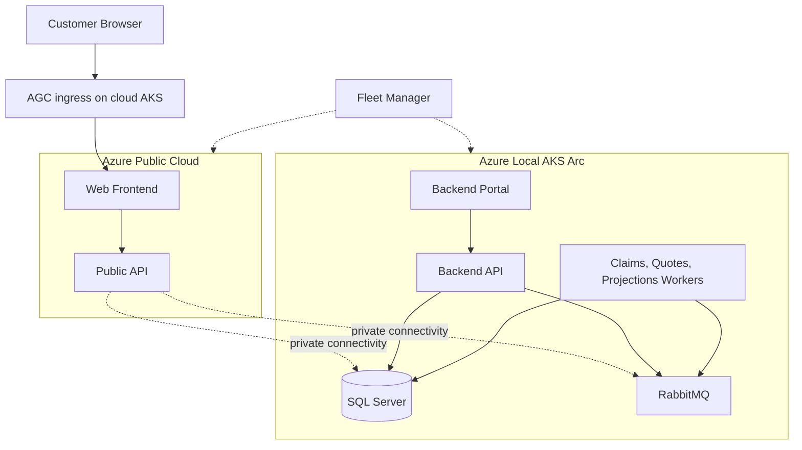

# Contoso Insurance

Contoso Insurance is a **.NET 10 Aspire enterprise application** and **learning lab** for moving a cloud-native system across the Azure deployment continuum: **Azure public cloud -> sovereign cloud -> hybrid cloud + Azure Local -> Azure Local connected -> Azure Local disconnected**.

This `local-hybrid` branch represents the **hybrid deployment**: customer-facing workloads stay on **cloud AKS**, sensitive services move to **Azure Local AKS Arc**, and **Azure Kubernetes Fleet Manager** provides a unified management plane across both clusters.



## Why this branch exists

Organizations with data sovereignty, compliance, or latency requirements often need a split architecture where:

- customer-facing services remain in Azure for internet reach and elasticity
- sensitive processing and storage move on-premises to Azure Local
- platform teams still manage both clusters as one application estate

This branch demonstrates that move without changing application code.

## Azure deployment continuum

The repository models a progressive move from fully public cloud to fully local deployment.



## Branch strategy

| Branch | What it represents | Deployment style |
| --- | --- | --- |
| `main` | Azure public cloud baseline | `azd up` |
| `sovereign` | Sovereign cloud deployment in Germany | `azd up` |
| `local-hybrid` | Split deployment across cloud AKS and Azure Local AKS Arc | PowerShell deployment script |
| `local-connected` | Azure Local connected deployment on Jumpstart LocalBox | PowerShell deployment script |
| `local-disconnected` | Future air-gapped Azure Local target | Future/offline workflow |

## Continuum branches

### `main` — Public Cloud

**What it deploys**
- Web frontend, public API, backend services, workers, RabbitMQ, and Azure SQL on Azure-hosted infrastructure
- AGC ingress on AKS

**Architecture overview**
- Single-cluster cloud baseline for standard Azure regions
- Managed Azure SQL data plane
- Best starting point for the continuum

**How to deploy**
```bash
azd up
```

### `sovereign` — Sovereign Cloud

**What it deploys**
- The same logical application topology as `main`
- Deployed into a sovereign Germany region for compliance and residency needs

**Architecture overview**
- Cloud-hosted deployment with regional sovereignty constraints
- Same service boundaries, different regional control plane and placement

**How to deploy**
```bash
git checkout sovereign
azd env new contoso-sovereign
azd up
```

### `local-hybrid` — Hybrid Cloud + Azure Local

**What it deploys**
- **Cloud side:** frontend and public API on cloud AKS with AGC ingress
- **Local side:** backend portal, backend API, workers, SQL Server, and RabbitMQ on AKS Arc in Azure Local
- **Fleet Manager:** unified management across both clusters

**Architecture overview**
- Internet-facing traffic stays in Azure
- Sensitive workflows and data stay on Azure Local
- Fleet placement and policy keep workloads on the correct side of the boundary



**Cross-cluster communication**
- In the intended design, the cloud public API reaches local RabbitMQ and SQL Server through **private networking** such as **VPN** or **ExpressRoute**.
- In the **Jumpstart LocalBox sandbox**, that private bridge may not exist by default. Without it, the cloud cluster cannot directly reach the local data plane, so hybrid validation is limited until networking is configured.
- The backend portal and backend API remain local-only and are never exposed to the public internet.

**How to deploy**
```powershell
git checkout local-hybrid
./scripts/deploy-hybrid.ps1 `
  -EnvironmentName <env> `
  -CloudClusterName <cloud-aks-name> `
  -CloudResourceGroup <cloud-rg> `
  -LocalClusterName <local-aks-arc-name> `
  -LocalResourceGroup <local-rg> `
  -SubscriptionId <subscription-id> `
  -AcrLoginServer <acr>.azurecr.io `
  -CloudRabbitMqHostName <local-rabbitmq-private-endpoint> `
  -CloudSqlPrivateEndpoint <local-sql-private-endpoint> `
  -Tag <image-tag>
```

### `local-connected` — Azure Local Connected

**What it deploys**
- The full application stack onto AKS Arc running on Jumpstart LocalBox
- Azure-connected operations through Arc-enabled services

**Architecture overview**
- Entire workload footprint runs on Azure Local
- Azure remains the connected control plane for Arc, monitoring, identity, and registry access
- This is the final connected step before a disconnected edge model

**How to deploy**
```powershell
git checkout local-connected
./scripts/deploy-local-connected.ps1 `
  -ResourceGroup <local-rg> `
  -ClusterName <local-aks-arc-name> `
  -AcrLoginServer <acr>.azurecr.io `
  -Tag <image-tag>
```

See [docs/local-connected-deployment.md](docs/local-connected-deployment.md) for the full walkthrough.

### `local-disconnected` — Future Azure Local Disconnected

**What it deploys**
- A future fully local, air-gapped version of Contoso Insurance

**Architecture overview**
- All runtime dependencies stay on-premises
- No required ongoing Azure control-plane connectivity
- Intended as the last stage of the continuum

**How to deploy**
- Not implemented yet; this branch is reserved for the future disconnected workflow.

## Hybrid workload placement

### Cloud AKS cluster

| Service | Role | Why cloud |
| --- | --- | --- |
| Web Frontend | Customer-facing UI | Internet reach and scale |
| Public API | Intake layer | Public entry point with AGC ingress |
| AGC | External ingress | Azure-managed L7 entry path |

### Azure Local AKS Arc cluster

| Service | Role | Why local |
| --- | --- | --- |
| Backend Portal | Staff-only UI | Internal-only access |
| Backend API | Sensitive business logic | Processes protected data |
| Workers | Claims, quotes, projections | Data gravity and local processing |
| RabbitMQ | Messaging backbone | Keeps sensitive payloads local |
| SQL Server | Operational data store | Keeps PII and line-of-business data on-prem |

## Fleet Manager

[Azure Kubernetes Fleet Manager](https://learn.microsoft.com/azure/kubernetes-fleet/) provides:

- unified management for cloud and local clusters
- placement control through `ClusterResourcePlacement`
- coordinated policy and lifecycle management across the fleet

## Prerequisites

### 1. Azure Local — Jumpstart LocalBox

> **⚠️ Azure Local must exist before deploying this branch.**

Use **[Jumpstart LocalBox](https://jumpstart.azure.com/azure_jumpstart_localbox)** to provision the Azure Local sandbox and AKS Arc environment.

Helpful references:
- [Azure Local prerequisites](docs/azure-local-prerequisites.md)
- [LocalBox Bicep deployment](https://jumpstart.azure.com/azure_jumpstart_localbox/deployment_az)
- [microsoft/azure_arc](https://github.com/microsoft/azure_arc)

### 2. Additional prerequisites

- Azure subscription access for AKS, ACR, Fleet Manager, and Azure Local resources
- Private connectivity between the cloud VNet and the Azure Local logical network if you want true end-to-end hybrid traffic
- Azure CLI with `aksarc`, `connectedk8s`, and `fleet` extensions
- `kubectl` access to both clusters

## Deployment flow for this branch

### 1. Provision the cloud side

```bash
azd up
```

### 2. Verify the local AKS Arc cluster

> ⏳ **Note:** AKS Arc cluster provisioning on Azure Local can take **60–90+ minutes** to complete. This is expected — the process downloads CBL-Mariner VM images, bootstraps the Kubernetes control plane, and provisions worker nodes on the physical hosts. Monitor progress with the command below and wait for `state: Succeeded` before proceeding.

```bash
az aksarc show --name <local-aks-arc-name> --resource-group <local-rg> --query "{state:properties.status.currentState, provisioning:provisioningState}" -o json
```

### 3. Deploy the hybrid workloads

```powershell
./scripts/deploy-hybrid.ps1 `
  -EnvironmentName dev `
  -CloudClusterName aks-zyvt5wdpz6bug `
  -CloudResourceGroup rg-contoso-cloud `
  -LocalClusterName contoso-aks-local `
  -LocalResourceGroup rg-azure-local `
  -SubscriptionId 7ffff279-b86c-4798-821a-1a70fc49e23b `
  -AcrLoginServer crzyvt5wdpz6bug.azurecr.io `
  -CloudRabbitMqHostName <rabbitmq-private-ip-or-dns> `
  -CloudSqlPrivateEndpoint <sql-private-ip-or-dns> `
  -Tag hybrid-v1
```

If the local cluster does not exist yet, the script can also create it when you provide the custom location and logical network inputs via `-CreateLocalCluster`.

## Repository structure

```text
k8s/
├── cloud/   # Frontend + public API manifests
├── local/   # Backend portal, backend API, workers, SQL Server, RabbitMQ
├── fleet/   # Fleet Manager placement manifests
infra/       # azd / Bicep deployment assets
scripts/     # Deployment automation
```

## Running locally

```bash
dotnet run --project src/ContosoInsurance.AppHost
```

## Testing

```bash
dotnet test ContosoInsurance.slnx
```

## References

- [Azure Jumpstart LocalBox](https://jumpstart.azure.com/azure_jumpstart_localbox)
- [Azure Local prerequisites](docs/azure-local-prerequisites.md)
- [Local-connected deployment guide](docs/local-connected-deployment.md)
- [Azure Kubernetes Fleet Manager](https://learn.microsoft.com/azure/kubernetes-fleet/)
- [AKS on Azure Local](https://learn.microsoft.com/azure/aks/hybrid/aks-overview)
- [Azure Arc-enabled Kubernetes](https://learn.microsoft.com/azure/azure-arc/kubernetes/overview)
