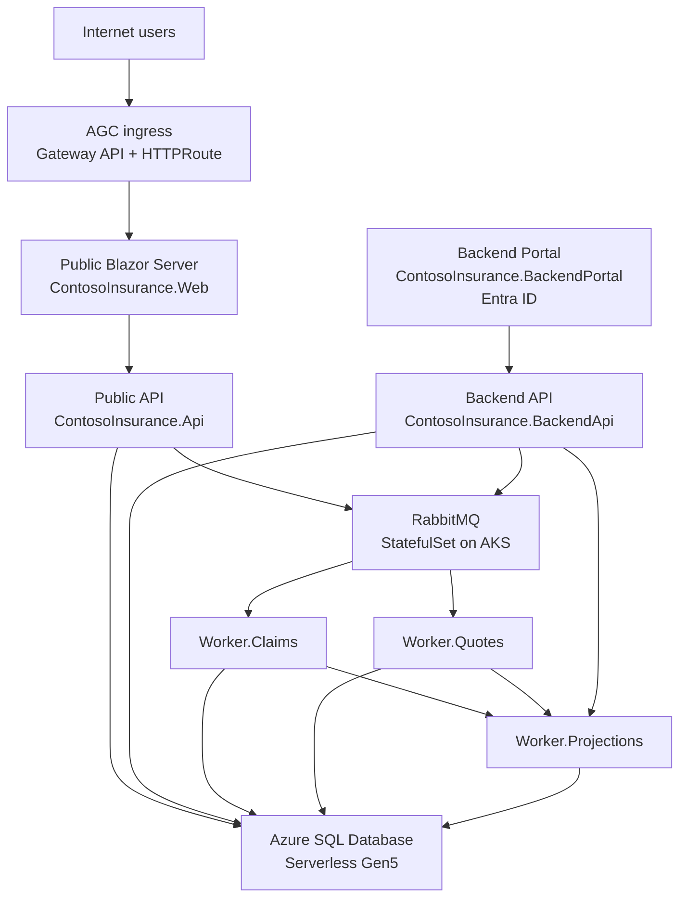

# Contoso Insurance

Contoso Insurance is a **.NET 10 Aspire enterprise application** and **learning lab** for moving a cloud-native system across the deployment continuum: **Azure cloud -> Azure Local connected -> Azure Local disconnected**.

This `main` branch represents the **cloud deployment baseline**: an AKS-hosted application using AGC for ingress, Azure SQL Database for persistence, RabbitMQ for event-driven workflows, and a split architecture that cleanly separates public and private surfaces.


## Why this repository exists

This solution is designed to help teams understand how to:

- build a modern distributed application with **.NET Aspire**
- run it on **Azure Kubernetes Service (AKS)**
- expose only the right services to the internet through **Application Gateway for Containers (AGC)**
- use **event-driven messaging** with RabbitMQ and background workers
- prepare the application for a **hybrid split** where the public surface remains in Azure and the private surface moves to **Azure Local**

## Branch strategy

| Branch | Target | Internet |
| --- | --- | --- |
| `main` | Azure (AKS) | Yes |
| `local-connected` | Azure Local Connected | Partial |
| `local-disconnected` | Azure Local Disconnected | No |

## Deployment baseline (`main`)

The main branch models the production cloud deployment:

- **Platform:** AKS
- **Ingress:** AGC (Application Gateway for Containers) with **Gateway API** + `HTTPRoute`
- **Database:** Azure SQL Database (**serverless Gen5**)
- **Messaging:** RabbitMQ running in AKS as a **StatefulSet**
- **Frontend URL:** http://bxf5ejdjesbkhrcf.fz45.alb.azure.com
- **Orchestration:** .NET Aspire AppHost for local orchestration and developer experience
- **Infrastructure as Code:** Bicep + Azure Developer CLI (`azd`)

## Application surfaces

Contoso Insurance uses a **two-surface architecture**.

### Public surface
Public-side services that handle customer traffic and event submission:

- **ContosoInsurance.Web** - public Blazor Server frontend
- **ContosoInsurance.Api** - customer-facing public API
- **RabbitMQ** - messaging backbone that receives events emitted from the public side

### Private surface
Internal services used by operations staff and business workflows:

- **ContosoInsurance.BackendPortal** - internal Blazor Server portal secured with **Microsoft Entra ID**
- **ContosoInsurance.BackendApi** - private workflow API for the portal
- **ContosoInsurance.Worker.Claims** - claims processing worker
- **ContosoInsurance.Worker.Quotes** - quote processing worker
- **ContosoInsurance.Worker.Projections** - projection and synchronization worker

This split is intentional: it supports the lab's target architecture where the **public surface stays in the cloud** while the **private surface can move to Azure Local**.

## Architecture overview



## End-to-end workflow

1. A customer uses the **public web frontend**.
2. The frontend calls the **public API**.
3. Claims and quotes submitted on the public surface are published as **events to RabbitMQ**.
4. The **Claims** and **Quotes** workers process those events.
5. The **Projections** worker publishes updated read models / projections back into the system.
6. Operations staff use the **Backend Portal** and **Backend API** to manage internal workflows and view operational state.

In short:

**public request -> public API -> RabbitMQ -> workers -> projections -> private operations experience**

## Service topology

| Service | Role | Surface |
| --- | --- | --- |
| `ContosoInsurance.AppHost` | .NET Aspire orchestrator for local development | Dev/orchestration |
| `ContosoInsurance.Web` | Public customer-facing Blazor Server app | Public |
| `ContosoInsurance.Api` | Public API serving the web frontend | Public |
| `RabbitMQ` | Event-driven messaging backbone | Shared boundary |
| `ContosoInsurance.BackendPortal` | Internal operations portal | Private |
| `ContosoInsurance.BackendApi` | Internal workflow API for the portal | Private |
| `ContosoInsurance.Worker.Claims` | Claims event processor | Private |
| `ContosoInsurance.Worker.Quotes` | Quotes event processor | Private |
| `ContosoInsurance.Worker.Projections` | Projection/read-model synchronization | Private |
| `ContosoInsurance.Data` | EF Core data layer | Shared library |
| `ContosoInsurance.Messaging.Contracts` | Shared event/message contracts | Shared library |
| `ContosoInsurance.ServiceDefaults` | Aspire service defaults and shared config | Shared library |

## Repository structure

```text
src/
├── ContosoInsurance.AppHost/             # .NET Aspire orchestrator
├── ContosoInsurance.Web/                 # Public Blazor frontend
├── ContosoInsurance.Api/                 # Public API (customer-facing)
├── ContosoInsurance.BackendPortal/       # Authenticated ops portal (Blazor)
├── ContosoInsurance.BackendApi/          # Private workflow API
├── ContosoInsurance.Worker.Claims/       # Claims processing worker
├── ContosoInsurance.Worker.Quotes/       # Quote processing worker
├── ContosoInsurance.Worker.Projections/  # Projection sync worker
├── ContosoInsurance.Data/                # EF Core data layer
├── ContosoInsurance.Messaging.Contracts/ # Shared message types
└── ContosoInsurance.ServiceDefaults/     # Aspire service defaults

tests/
├── ContosoInsurance.Api.Tests/
├── ContosoInsurance.Data.Tests/
├── ContosoInsurance.Web.Tests/
├── ContosoInsurance.Worker.Tests/
├── ContosoInsurance.AppHost.Tests/
└── ContosoInsurance.E2E/                 # Playwright E2E tests

k8s/                                      # Kubernetes manifests
scripts/                                  # Deployment scripts
infra/                                    # Bicep IaC (azd)
docs/screenshots/                         # App screenshots
```

## Deployment model

### Azure deployment

Provision infrastructure and deploy with **Azure Developer CLI**:

```bash
azd up
```

Key deployment assets:

- `infra/` - Bicep templates used by `azd`
- `scripts/deploy-all.ps1` - publishes containers and deploys Kubernetes manifests
- `k8s/` - workload manifests for web, APIs, RabbitMQ, and workers

AGC provides the **Layer 7 ingress path** using **Gateway API** and `HTTPRoute`, giving the application a modern ingress layer aligned with the cloud-first `main` branch architecture.

## Running locally

Run the distributed application with Aspire:

```bash
dotnet run --project src/ContosoInsurance.AppHost
```

Local development uses containers for supporting services:

- **SQL Server** runs as a container
- **RabbitMQ** runs as a container
- Aspire wires service discovery, startup ordering, and local endpoints automatically

## Testing

Run the existing test suites from the repository root:

```bash
dotnet test ContosoInsurance.slnx
```

The repository also includes **Playwright end-to-end tests** in `tests/ContosoInsurance.E2E/`.

## Screenshots

Application screenshots are available in `docs/screenshots/`, including:

- `homepage.png`
- `customers.png`
- `policies.png`
- `claims.png`
- `quotes.png`
- `dashboard.png`
- `backend-portal-dashboard.png`
- `backend-portal-claims.png`
- `backend-portal-quotes.png`
- `backend-portal-queue.png`

## Learning lab focus

Contoso Insurance is intentionally more than an app sample. It is a **reference implementation for hybrid modernization**:

- start with a cloud-native Azure deployment
- preserve clear public/private boundaries
- move private capabilities closer to the edge with Azure Local
- continue toward disconnected operation when required

That makes this repository useful both for **application teams** learning .NET Aspire and for **platform teams** planning cloud-to-edge transitions.
