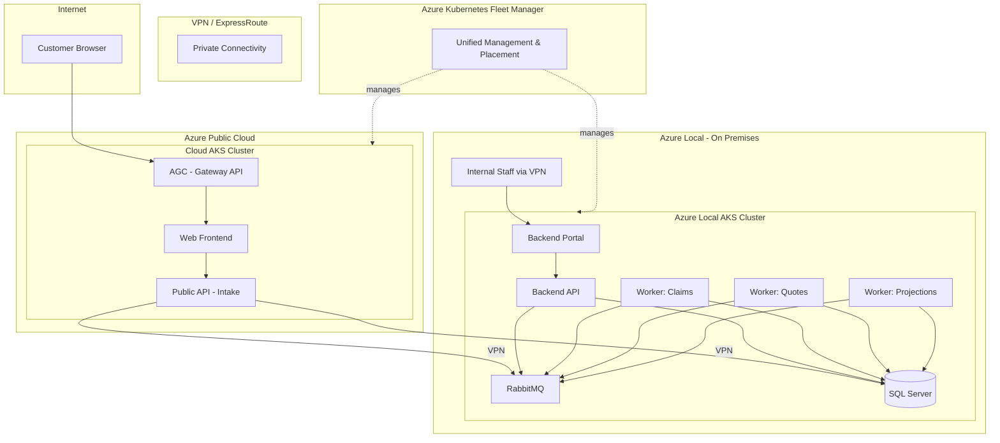

# Contoso Insurance

Contoso Insurance is a **.NET 10 Aspire enterprise application** and **learning lab** for moving a cloud-native system across the Azure deployment continuum: **Azure public cloud → sovereign cloud → hybrid (cloud + Azure Local) → Azure Local connected → Azure Local disconnected**.

This `local-hybrid` branch represents the **hybrid deployment**: workloads are split across an **Azure public cloud AKS cluster** and an **Azure Local AKS cluster**, managed as a single fleet by **Azure Kubernetes Fleet Manager**.


## Why this branch exists

Organizations with data sovereignty, compliance, or latency requirements often need a **hybrid split** where:
- Customer-facing services remain in the public cloud for scalability and global reach
- Sensitive data processing and storage stays on-premises for regulatory compliance
- A unified management plane (Fleet Manager) provides consistent operations across both environments

This branch demonstrates that architecture with **zero application code changes** — only infrastructure and deployment configuration differs.

## Branch strategy

| Branch | Target | Internet | Data Location |
| --- | --- | --- | --- |
| `main` | Azure Public Cloud (AKS) | Yes | Azure |
| `sovereign` | Sovereign Cloud (Germany) | Yes | Sovereign region |
| **`local-hybrid`** | **Cloud + Azure Local** | **Partial** | **Split** |
| `local-connected` | Azure Local Connected | Partial | On-premises |
| `local-disconnected` | Azure Local Disconnected | No | On-premises |

## Hybrid Architecture



## Workload Placement

### Cloud AKS Cluster (public, internet-facing)

| Service | Purpose | Why Cloud? |
| --- | --- | --- |
| **Web Frontend** | Customer-facing UI | Needs internet accessibility, CDN proximity |
| **Public API** | Intake layer for customer requests | Entry point — publishes to on-prem queue |
| **AGC (Gateway API)** | Ingress controller | Azure-managed external load balancer |

### Azure Local AKS Cluster (private, on-premises)

| Service | Purpose | Why On-Premises? |
| --- | --- | --- |
| **Backend API** | Sensitive business logic | Processes PII, claims decisions |
| **Backend Portal** | Staff admin interface | Internal-only, no internet exposure |
| **Worker: Claims** | Claims processing | Handles sensitive customer data |
| **Worker: Quotes** | Quote generation | Pricing algorithms, proprietary data |
| **Worker: Projections** | Financial projections | Actuarial data, must stay local |
| **RabbitMQ** | Message broker | Messages contain sensitive payloads |
| **SQL Server** | Database | Customer PII, claims, policies |

## Cross-Cluster Connectivity

The cloud Public API communicates with on-premises services via **VPN/ExpressRoute**:

```
Cloud Public API  →  VPN/ExpressRoute  →  Internal LB (Azure Local)  →  RabbitMQ/SQL
```

- **RabbitMQ**: Exposed via internal LoadBalancer (`rabbitmq-vpn` service) on Azure Local
- **SQL Server**: Exposed via internal LoadBalancer (`sqlserver-vpn` service) on Azure Local
- **No public endpoints**: All cross-cluster traffic traverses private network only
- **Network policies**: Zero-trust policies on both clusters restrict traffic to required flows

## Fleet Manager

[Azure Kubernetes Fleet Manager](https://learn.microsoft.com/azure/kubernetes-fleet/) provides:

- **Unified management**: Single pane of glass for both clusters
- **Workload placement**: `ClusterResourcePlacement` with `PickFixed` scheduling
- **Update orchestration**: Coordinated Kubernetes version and node image upgrades
- **Policy propagation**: Consistent RBAC and network policies across the fleet

Fleet manifests are in `k8s/fleet/`.

## Prerequisites

### 1. Azure Local — Jumpstart LocalBox (required)

> **⚠️ You must deploy Azure Local before deploying this branch.**

The Azure Local cluster is provided by **[Jumpstart LocalBox](https://jumpstart.azure.com/azure_jumpstart_localbox)** — a turnkey deployment that simulates a 2-node Azure Local cluster with AKS Arc using nested Hyper-V.

👉 **[Full setup guide: docs/azure-local-prerequisites.md](docs/azure-local-prerequisites.md)**

Quick links:
- [Jumpstart LocalBox](https://jumpstart.azure.com/azure_jumpstart_localbox)
- [LocalBox Bicep Deployment](https://jumpstart.azure.com/azure_jumpstart_localbox/deployment_az)
- [microsoft/azure_arc repository](https://github.com/microsoft/azure_arc)

After deploying LocalBox you will have:
- An AKS Arc cluster (`localbox-aks`) registered with Azure Arc
- A logical network (`10.10.0.0/24`) for workload connectivity
- A management VM (`LocalBox-Client`) with kubectl and az CLI pre-installed

### 2. Additional prerequisites

- **Azure subscription** with permissions to create AKS, ACR, Fleet Manager, VPN Gateway
- **VPN/ExpressRoute** connectivity between Azure cloud VNet and the LocalBox logical network
- **Azure CLI** (`az`) with `fleet`, `connectedk8s`, `aksarc` extensions
- **kubectl** configured for both clusters

## Deployment

### 1. Deploy Azure Local (Jumpstart LocalBox)

Follow **[docs/azure-local-prerequisites.md](docs/azure-local-prerequisites.md)** to deploy LocalBox. This takes 45–90 minutes and gives you the `localbox-aks` AKS Arc cluster.

Get the cluster resource ID after deployment:
```bash
az connectedk8s show -n localbox-aks -g <localbox-rg> --query id -o tsv
```

### 2. Provision cloud infrastructure

```bash
# Deploy cloud infrastructure (AKS, ACR, AGC, Fleet Manager)
azd up

# Or manually with Bicep:
az deployment sub create \
  --location eastus2 \
  --template-file infra/main.bicep \
  --parameters environmentName=dev location=eastus2 \
               localAksClusterResourceId=$(az connectedk8s show -n localbox-aks -g <localbox-rg> --query id -o tsv)
```

### 3. Configure VPN/ExpressRoute

Ensure private connectivity between the cloud VNet and Azure Local network.
Note the internal LoadBalancer IPs assigned to `rabbitmq-vpn` and `sqlserver-vpn` services.

### 4. Deploy workloads

```powershell
# Set the private endpoint addresses (from Azure Local internal LBs)
$env:RABBITMQ_PRIVATE_ENDPOINT = "10.10.0.100"  # Replace with actual LB IP from LocalBox
$env:SQL_PRIVATE_ENDPOINT = "10.10.0.101"        # Replace with actual LB IP from LocalBox

./scripts/deploy-hybrid.ps1 `
  -EnvironmentName dev `
  -CloudClusterName aks-cloud `
  -LocalClusterName localbox-aks `
  -ResourceGroup rg-dev `
  -LocalResourceGroup rg-localbox `
  -Tag "latest"
```

### 5. Apply Fleet placement policies

```bash
# Connect to Fleet hub
az fleet get-credentials --resource-group rg-dev --name <fleet-name>

# Apply placement policies
kubectl apply -f k8s/fleet/
```

## Directory Structure

```text
k8s/
├── cloud/              # Manifests for Azure public cloud AKS cluster
│   ├── namespace.yaml  # Namespace, ConfigMap, Secrets (cloud-specific)
│   ├── web-deployment.yaml
│   ├── api-deployment.yaml
│   └── network-policies.yaml
├── local/              # Manifests for Azure Local AKS cluster
│   ├── namespace.yaml  # Namespace, ConfigMap, Secrets (local-specific)
│   ├── backend-api-deployment.yaml
│   ├── backend-portal-deployment.yaml
│   ├── workers-deployment.yaml
│   ├── rabbitmq-deployment.yaml
│   ├── sqlserver-deployment.yaml
│   └── network-policies.yaml
├── fleet/              # Fleet Manager placement policies
│   ├── cluster-resource-placement.yaml
│   └── member-clusters.yaml
infra/
├── main.bicep          # Orchestration (includes Fleet module)
├── modules/
│   ├── fleet.bicep     # Fleet Manager hub + members
│   ├── aks.bicep       # Cloud AKS cluster
│   └── ...
scripts/
├── deploy-hybrid.ps1   # Multi-cluster deployment script
```

## Security Model

| Layer | Cloud Cluster | Local Cluster |
| --- | --- | --- |
| **Ingress** | AGC (external) | Internal LB (VPN only) |
| **Network** | Zero-trust NetworkPolicy | Zero-trust NetworkPolicy |
| **Identity** | Workload identity (Entra) | Workload identity (Entra via Arc) |
| **Secrets** | Key Vault CSI | Kubernetes Secrets (encrypted at rest) |
| **Data** | No PII stored | All PII remains on-premises |
| **Cross-cluster** | VPN/ER only (no public) | VPN/ER only (no public) |

## Key Differences from `main` Branch

| Aspect | `main` (single cluster) | `local-hybrid` (split) |
| --- | --- | --- |
| Clusters | 1 AKS | 2 (cloud AKS + Azure Local AKS) |
| Management | Direct kubectl | Fleet Manager |
| Database | Azure SQL (PaaS) | SQL Server container (on-prem) |
| Messaging | RabbitMQ (same cluster) | RabbitMQ (on-prem, VPN access) |
| Data boundary | Azure region | On-premises for sensitive data |
| Ingress | AGC for all | AGC (public) + Internal LB (staff) |
| Network | Single-cluster policies | Cross-cluster + per-cluster policies |

## Running locally

Run the distributed application with Aspire (unchanged from `main`):

```bash
dotnet run --project src/ContosoInsurance.AppHost
```

## Testing

```bash
dotnet test ContosoInsurance.slnx
```

## Learning lab focus

This branch is part of the **Azure deployment continuum learning lab**:

1. **`main`** — Start with cloud-native on Azure public cloud
2. **`sovereign`** — Adapt for sovereign region compliance
3. **`local-hybrid`** — Split workloads: public cloud + on-premises (this branch)
4. **`local-connected`** — Move entirely to Azure Local with Arc connectivity
5. **`local-disconnected`** — Full air-gapped operation

## References

- [Azure Jumpstart LocalBox](https://jumpstart.azure.com/azure_jumpstart_localbox) — Deploy Azure Local without hardware
- [LocalBox Bicep Deployment](https://jumpstart.azure.com/azure_jumpstart_localbox/deployment_az) — Step-by-step deployment guide
- [microsoft/azure_arc](https://github.com/microsoft/azure_arc) — Source repository for Jumpstart scenarios
- [Azure Kubernetes Fleet Manager](https://learn.microsoft.com/azure/kubernetes-fleet/) — Multi-cluster management
- [AKS on Azure Local](https://learn.microsoft.com/azure/aks/hybrid/aks-overview) — AKS Arc documentation
- [Azure Arc-enabled Kubernetes](https://learn.microsoft.com/azure/azure-arc/kubernetes/overview) — Arc K8s overview
