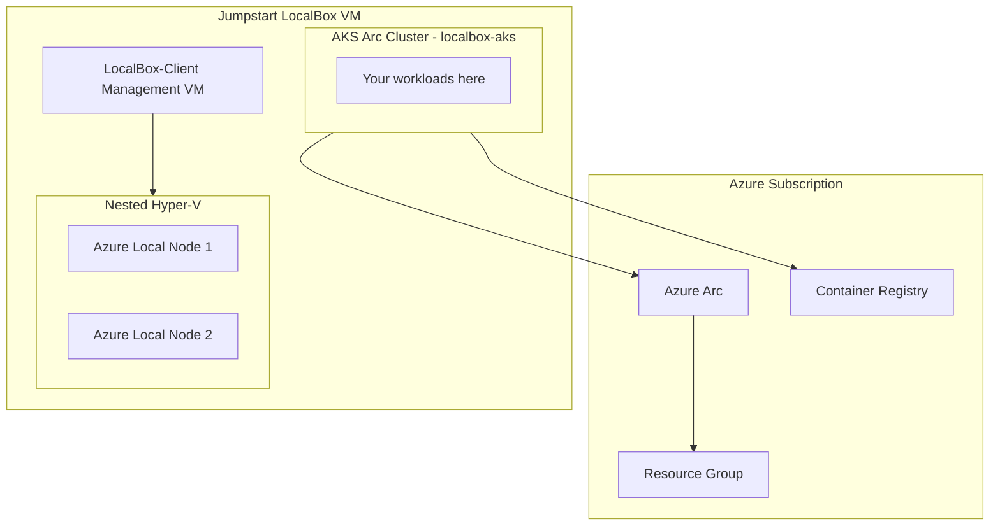

# Azure Local Prerequisites — Jumpstart LocalBox

This document describes how to deploy the **Azure Local** infrastructure required by the `local-hybrid` and `local-connected` branches using [Azure Jumpstart LocalBox](https://jumpstart.azure.com/azure_jumpstart_localbox).

## What is Jumpstart LocalBox?

[Jumpstart LocalBox](https://jumpstart.azure.com/azure_jumpstart_localbox) is a turnkey deployment that simulates a 2-node Azure Local cluster using nested Hyper-V virtualization. It provisions:

- An Azure Local cluster (simulated with nested VMs)
- AKS Arc workload cluster (`localbox-aks`)
- Azure Arc connectivity back to your Azure subscription
- Networking (logical networks, DHCP, DNS)
- A management VM (`LocalBox-Client`) for administration

This gives you a fully functional Azure Local environment **without physical hardware**.

> **Source repository:** [microsoft/azure_arc](https://github.com/microsoft/azure_arc)
> **Deployment guide:** [Jumpstart LocalBox — Azure Bicep deployment](https://jumpstart.azure.com/azure_jumpstart_localbox/deployment_az)

## Prerequisites

| Requirement | Details |
| --- | --- |
| **Azure subscription** | Owner or Contributor role |
| **Quota** | At least 32 vCPUs for `Standard_D` or `Standard_E` series in your target region |
| **Resource providers** | `Microsoft.HybridCompute`, `Microsoft.Kubernetes`, `Microsoft.KubernetesConfiguration`, `Microsoft.ExtendedLocation`, `Microsoft.AzureArcData` |
| **Azure CLI** | v2.60+ with `connectedk8s`, `aksarc` extensions |
| **Entra ID group** | A security group for AKS RBAC (members get cluster-admin) |

## Step 1 — Register resource providers

```bash
az provider register --namespace Microsoft.HybridCompute
az provider register --namespace Microsoft.Kubernetes
az provider register --namespace Microsoft.KubernetesConfiguration
az provider register --namespace Microsoft.ExtendedLocation
az provider register --namespace Microsoft.AzureArcData
az provider register --namespace Microsoft.HybridContainerService
```

## Step 2 — Deploy Jumpstart LocalBox

### Option A: Azure Portal (one-click)

Use the "Deploy to Azure" button on the [Jumpstart LocalBox deployment page](https://jumpstart.azure.com/azure_jumpstart_localbox/deployment_az).

### Option B: Azure CLI + Bicep

```bash
# Clone the azure_arc repository
git clone https://github.com/microsoft/azure_arc.git
cd azure_arc/azure_jumpstart_localbox

# Create a resource group for LocalBox
az group create --name rg-localbox --location eastus2

# Deploy LocalBox (fill in parameters)
az deployment group create \
  --resource-group rg-localbox \
  --template-file bicep/main.bicep \
  --parameters \
    windowsAdminUsername="arcdemo" \
    windowsAdminPassword="<YourPassword>" \
    tenantId="$(az account show --query tenantId -o tsv)" \
    subscriptionId="$(az account show --query id -o tsv)" \
    spnClientId="<service-principal-app-id>" \
    spnClientSecret="<service-principal-secret>" \
    entraGroupObjectId="<your-entra-group-object-id>"
```

> **Tip:** Create a service principal beforehand:
> ```bash
> az ad sp create-for-rbac --name "jumpstart-localbox-sp" \
>   --role "Contributor" \
>   --scopes "/subscriptions/$(az account show --query id -o tsv)"
> ```

### Option C: Terraform

See the [Terraform deployment guide](https://jumpstart.azure.com/azure_jumpstart_localbox/deployment_terraform).

## Step 3 — Wait for deployment (45–90 minutes)

LocalBox deployment takes approximately 45–90 minutes. It provisions:
1. A Windows Server client VM (`LocalBox-Client`)
2. Nested Hyper-V VMs simulating Azure Local nodes
3. Azure Local cluster registration with Azure Arc
4. AKS Arc workload cluster creation (`localbox-aks`)
5. Network configuration (logical networks, MetalLB)

Monitor progress via the Azure Portal → Resource Group → Deployments.

## Step 4 — Connect to LocalBox-Client

```bash
# RDP into the client VM (enable NSG rule or use Bastion/JIT)
# Default credentials: arcdemo / <password you set>
mstsc /v:<LocalBox-Client-public-IP>
```

## Step 5 — Verify the AKS Arc cluster

From the `LocalBox-Client` VM:

```powershell
# Login to Azure
az login --use-device-code --tenant $env:tenantId

# Verify the AKS Arc cluster exists
az aksarc list --resource-group $env:resourceGroup --query "[].{name:name, state:provisioningState}" -o table

# Connect to the cluster via Arc proxy
az connectedk8s proxy -n localbox-aks -g $env:resourceGroup

# In another terminal, verify access
kubectl get nodes
kubectl get namespaces
```

## Step 6 — Note the cluster details for Contoso Insurance deployment

After LocalBox is deployed, collect these values for the Contoso Insurance deployment scripts:

| Value | How to get it |
| --- | --- |
| **AKS Arc cluster name** | `localbox-aks` (default) |
| **Resource group** | The resource group you deployed LocalBox into |
| **Cluster resource ID** | `az connectedk8s show -n localbox-aks -g <rg> --query id -o tsv` |
| **Logical network subnet** | Default: `10.10.0.0/24` |

## Architecture Reference



## Troubleshooting

| Issue | Resolution |
| --- | --- |
| Deployment timeout | Check Azure portal for nested deployments; some extensions take 20+ min |
| Cannot RDP to LocalBox-Client | Enable JIT access or add NSG rule for your IP on port 3389 |
| AKS cluster not ready | On LocalBox-Client, run `Get-AksArcCluster` to check status |
| `kubectl` auth errors | Ensure you're logged in as a member of the Entra ID group |
| `az aksarc create` says the logical network has no DNS server | LocalBox's `localboxcluster-InfraLNET` is an infrastructure network. Create a workload logical network on the same VM switch with DNS servers and use that network ID for the AKS Arc cluster instead. |
| Quota errors | Request quota increase for D/E-series VMs in your region |

## Next Steps

Once LocalBox is deployed and the AKS Arc cluster (`localbox-aks`) is ready:

- **For `local-hybrid` branch:** Use the cluster resource ID when running `deploy-hybrid.ps1` as the local cluster target. See the [main README](../README.md) for deployment instructions.
- **For `local-connected` branch:** Deploy all Contoso Insurance workloads onto `localbox-aks`. See [local-connected-deployment.md](local-connected-deployment.md).

## References

- [Azure Jumpstart LocalBox](https://jumpstart.azure.com/azure_jumpstart_localbox)
- [LocalBox Deployment (Azure Bicep)](https://jumpstart.azure.com/azure_jumpstart_localbox/deployment_az)
- [microsoft/azure_arc GitHub repository](https://github.com/microsoft/azure_arc)
- [AKS on Azure Local documentation](https://learn.microsoft.com/azure/aks/hybrid/aks-overview)
- [Azure Arc-enabled Kubernetes](https://learn.microsoft.com/azure/azure-arc/kubernetes/overview)
