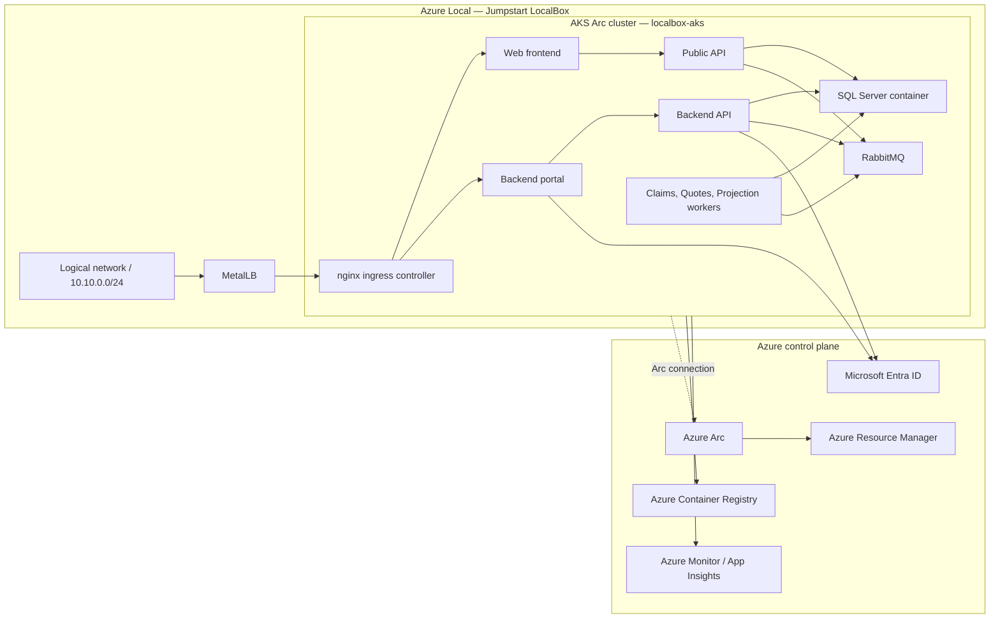

# Local-connected deployment guide

The `local-connected` branch shows how the same Contoso Insurance application moves from Azure public cloud into a connected hybrid deployment on **Azure Local**.

## What this branch demonstrates

- Deployment into the **Azure Local Jumpstart LocalBox** sandbox
- Kubernetes workloads running with **AKS Arc** (`localbox-aks`)
- **Arc-enabled services** and extensions providing Azure-based hybrid management
- The transition point between fully public/sovereign cloud hosting and fully disconnected edge hosting

## Prerequisites — Azure Local (Jumpstart LocalBox)

> **⚠️ You must deploy Azure Local before deploying this branch.**

This branch assumes you have a running Azure Local environment with an AKS Arc cluster. The recommended way to get this is via **Jumpstart LocalBox**:

👉 **[Azure Local Prerequisites — Jumpstart LocalBox](azure-local-prerequisites.md)**

Follow that guide to deploy LocalBox, which provisions:
- A simulated 2-node Azure Local cluster
- An AKS Arc workload cluster (`localbox-aks`)
- Azure Arc connectivity
- Networking (logical networks, MetalLB)

### Quick reference links

| Resource | URL |
| --- | --- |
| **Jumpstart LocalBox** | https://jumpstart.azure.com/azure_jumpstart_localbox |
| **LocalBox Bicep deployment** | https://jumpstart.azure.com/azure_jumpstart_localbox/deployment_az |
| **azure_arc repository** | https://github.com/microsoft/azure_arc |
| **AKS on Azure Local docs** | https://learn.microsoft.com/azure/aks/hybrid/aks-overview |

## Target platform

The connected hybrid stage keeps the application architecture intact while changing the hosting model:

- The application workloads run on Azure Local infrastructure (AKS Arc on LocalBox)
- Kubernetes is provided through **AKS Arc** (cluster name: `localbox-aks`)
- Azure Arc keeps management, governance, and connected operations available from Azure
- Container images are pulled from Azure Container Registry over the Arc connection
- Identity (Entra ID) and monitoring (App Insights) remain Azure-hosted services

## Architecture on Azure Local



## Deployment workflow

### 1. Deploy Jumpstart LocalBox

Follow **[docs/azure-local-prerequisites.md](azure-local-prerequisites.md)** to provision your Azure Local environment and AKS Arc cluster.

### 2. Connect to the AKS Arc cluster

From the `LocalBox-Client` VM:

```powershell
# Authenticate
az login --use-device-code --tenant $env:tenantId

# Connect via Arc proxy
az connectedk8s proxy -n localbox-aks -g $env:resourceGroup

# Verify
kubectl get nodes
```

### 3. Push container images to ACR

```bash
# From your development machine (with the repo checked out on local-connected branch)
ACR_NAME=$(az acr list --resource-group <rg> --query '[0].name' -o tsv)
az acr login --name $ACR_NAME

# Build and push all images
docker build -f src/ContosoInsurance.Web/Dockerfile -t $ACR_NAME.azurecr.io/contoso-insurance/webfrontend:latest .
docker build -f src/ContosoInsurance.Api/Dockerfile -t $ACR_NAME.azurecr.io/contoso-insurance/publicapi:latest .
docker build -f src/ContosoInsurance.BackendApi/Dockerfile -t $ACR_NAME.azurecr.io/contoso-insurance/backendapi:latest .
docker build -f src/ContosoInsurance.BackendPortal/Dockerfile -t $ACR_NAME.azurecr.io/contoso-insurance/backendportal:latest .
docker build -f src/ContosoInsurance.Worker.Claims/Dockerfile -t $ACR_NAME.azurecr.io/contoso-insurance/worker-claims:latest .
docker build -f src/ContosoInsurance.Worker.Quotes/Dockerfile -t $ACR_NAME.azurecr.io/contoso-insurance/worker-quotes:latest .
docker build -f src/ContosoInsurance.Worker.Projections/Dockerfile -t $ACR_NAME.azurecr.io/contoso-insurance/worker-projections:latest .

docker push $ACR_NAME.azurecr.io/contoso-insurance/webfrontend:latest
docker push $ACR_NAME.azurecr.io/contoso-insurance/publicapi:latest
docker push $ACR_NAME.azurecr.io/contoso-insurance/backendapi:latest
docker push $ACR_NAME.azurecr.io/contoso-insurance/backendportal:latest
docker push $ACR_NAME.azurecr.io/contoso-insurance/worker-claims:latest
docker push $ACR_NAME.azurecr.io/contoso-insurance/worker-quotes:latest
docker push $ACR_NAME.azurecr.io/contoso-insurance/worker-projections:latest
```

### 4. Deploy workloads to AKS Arc

From the `LocalBox-Client` VM (connected to `localbox-aks` via Arc proxy):

```powershell
# Run the deployment script
./scripts/deploy-local-connected.ps1 `
  -ResourceGroup <localbox-resource-group> `
  -ClusterName localbox-aks `
  -AcrLoginServer "$ACR_NAME.azurecr.io" `
  -Tag latest
```

### 5. Access the application

The application is exposed via MetalLB on the LocalBox logical network:

```powershell
# Get the ingress IP
kubectl get svc -n contoso-insurance -l app=nginx-ingress

# Access from the LocalBox-Client VM browser:
# http://<MetalLB-IP>  → Web Frontend
# http://<MetalLB-IP>/admin  → Backend Portal
```

## What runs where

| Component | Location | Notes |
| --- | --- | --- |
| AKS Arc cluster, all app services | Azure Local (LocalBox) | All workloads on-prem |
| Azure Arc control plane | Azure | Governance, policy, monitoring |
| Container images | Azure Container Registry | Pulled over Arc connection |
| Identity (Entra ID) | Azure | Backend portal/API auth |
| Monitoring telemetry | Azure Monitor | Optional, can be disabled for disconnected |

## Why it matters

This branch is the bridge between public or sovereign Azure deployments and a fully disconnected Azure Local environment. It shows that the **same application** can keep its architecture and service boundaries while the hosting model shifts to hybrid, Arc-managed infrastructure — all running on a Jumpstart LocalBox sandbox that requires no physical hardware.

## References

- [Azure Jumpstart LocalBox](https://jumpstart.azure.com/azure_jumpstart_localbox)
- [LocalBox Deployment (Azure Bicep)](https://jumpstart.azure.com/azure_jumpstart_localbox/deployment_az)
- [microsoft/azure_arc repository](https://github.com/microsoft/azure_arc)
- [AKS on Azure Local](https://learn.microsoft.com/azure/aks/hybrid/aks-overview)
- [Azure Arc-enabled Kubernetes](https://learn.microsoft.com/azure/azure-arc/kubernetes/overview)
